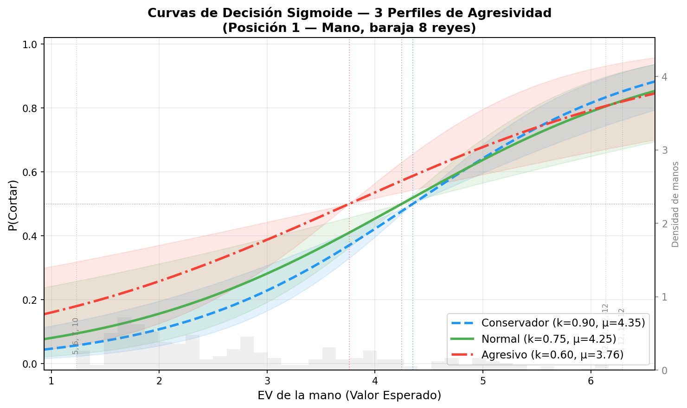
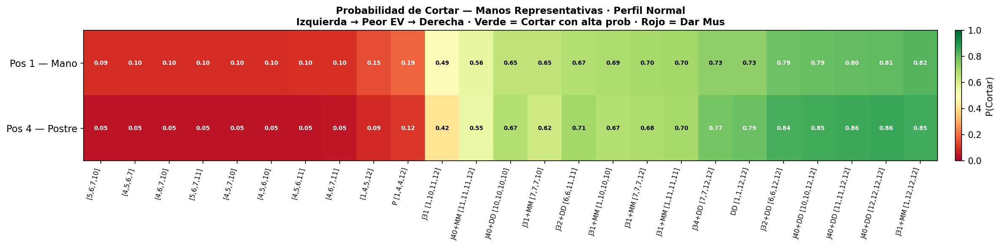
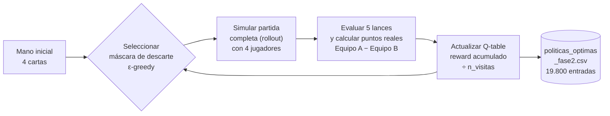

# 🎴 Sistema de Análisis Probabilístico del Mus — Motor IA

> **El Mus es un juego de información imperfecta**: los jugadores toman decisiones con cartas parcialmente ocultas, sin saber qué tiene el rival. El reto matemático es cuantificar el valor de cada mano frente a un adversario desconocido y actualizar esa estimación en tiempo real conforme se revela información (cuántas cartas descarta cada rival). Este sistema lo resuelve combinando **cálculo exacto de probabilidades condicionadas** mediante distribución hipergeométrica sobre las 330 manos únicas de la baraja de 8 reyes, con **Q-Learning por rollout completo** (40 millones de partidas simuladas) para aprender políticas de descarte óptimas. El resultado es un motor de decisión estocástico con fundamento matemático riguroso, calibrables a tres perfiles de agresividad y con interfaz web interactiva.

**Versión**: v2.5 — Marzo 2026 · **Autor**: Marco Ezquerra · **Lances**: Grande, Chica, Pares, Juego y Punto

---

## 🎯 Características

- **Motor de Decisión IA** basado en Valor Esperado (EV) con probabilidades hipergeométricas exactas
- **330 manos únicas** catalogadas en baraja de 8 reyes (`1, 4, 5, 6, 7, 10, 11, 12`) con estadísticas precomputadas
- **Lance de Juego con jerarquía estricta por rango**: 31 > 32 > 40 > 37 > 36 > 35 > 34 > 33
  - As = 1 punto · Sota/Caballo/Rey = 10 puntos · resto = valor nominal
  - 31 vale 3 puntos base; todos los demás juegos valen 2 puntos base
- **Lance de Punto** completo cuando ningún jugador alcanza juego (≥ 31 puntos)
- **Política estocástica** (sigmoide con ruido gaussiano) — no determinista, no explotable
- **3 perfiles de agresividad**: Conservador, Normal, Agresivo
- **Fase 2 — Q-Learning**: 19.800 entradas de política óptima de descarte (330 × 4 posiciones × 15 máscaras, ~29.000 visitas por entrada)
- **Probabilidades condicionadas a segundas dadas**: 64 configuraciones × 330 manos basadas en cuántas cartas guarda cada rival

---

## 🚀 Inicio Rápido

```bash
git clone https://github.com/Marco-Ezquerra/Probabilidades-Mus
cd Probabilidades-Mus
pip install -r requirements.txt

# Demo en terminal
python3 demos/demo_interactiva.py

# Web App (Streamlit)
streamlit run demos/app.py
```

---

## 📊 Ranking de Manos — Extremos por EV

Valores Esperados calculados en **posición 1 (Mano)**, perfil Normal, baraja 8 reyes.

### 🏆 Top 3 — Manos con Mayor EV

| Mano | Pares | Juego | EV pos. Mano |
|------|-------|-------|:------------:|
| `[1, 12, 12, 12]` | Medias | **31** (La 31) | **6.29** |
| `[12, 12, 12, 12]` | Duples | 40 | **6.14** |
| `[11, 11, 12, 12]` | Duples | 40 | **6.11** |

> La mano óptima es **As + tres Reyes**: consigue la 31 exacta (1+10+10+10), domina simultáneamente en Juego (mejor rango posible), Pares (medias) y Chica (el As es carta baja).

### ⚠️ Bottom 3 — Manos con Menor EV

| Mano | Pares | Juego | EV pos. Mano |
|------|-------|-------|:------------:|
| `[4, 6, 7, 10]` | Sin pares | — | **1.27** |
| `[4, 5, 6, 7]` | Sin pares | — | **1.25** |
| `[5, 6, 7, 10]` | Sin pares | — | **1.23** |

> Las peores manos son cartas medianas sin repetición: no ganan en Grande (sin figuras), no tienen pares ni juego, y su punto es mediocre.

---

## 🎮 Arquitectura del Sistema

### Fase 1 — Motor de Decisión: CORTAR o dar MUS

El motor evalúa el Valor Esperado sumando la contribución de los cinco lances:

$$\text{EV}_{\text{Total}} = \sum_{L \in \{\text{Grande, Chica, Pares, Juego, Punto}\}} \left( \text{EV}_{\text{Propio}}^{L} + \beta \cdot \text{EV}_{\text{Soporte}}^{L} \right)$$

**Puntuación por lance:**

| Lance | Puntos ganador | Condición |
|-------|---------------|-----------|
| Grande / Chica | 1 pt fijo | Siempre se juega |
| Pares | Suma equipo: 1 (pares) / 2 (medias) / 3 (duples) | Si algún jugador tiene pares |
| Juego | La 31 = **3 pts** · resto juegos = **2 pts** | Si algún jugador tiene juego |
| Punto | 1 pt | Solo si ningún jugador tiene juego |

**Probabilidades condicionadas exactas (distribución hipergeométrica):**

Para cada mano propia de 4 cartas quedan 36 en el mazo. Se calcula exactamente la probabilidad de que al menos uno de los dos rivales tenga la jugada considerando la composición real de las 36 cartas restantes.

**Perfiles de agresividad:**

| Perfil | β (confianza compañero) | Umbral μ | Comportamiento |
|--------|-------------------------|----------|----------------|
| Conservador | 0.65 | p80 | Corta solo con EVs altos |
| Normal | 0.75 | p74 | Equilibrado — referencia |
| Agresivo | 0.85 | p65 | Mayor tolerancia al riesgo |

#### Política Estocástica

La decisión no es determinista: incorpora variabilidad controlada mediante función sigmoide con ruido gaussiano, evitando que el motor sea predecible y explotable.

$$P(\text{Cortar}) = \sigma\!\bigl(K \cdot (\text{EV} - \mu)\bigr), \qquad K \sim \mathcal{N}(k_{\text{base}},\, \sigma^2)$$

---



*Probabilidad de Cortar en función del EV de la mano para los tres perfiles. El perfil Agresivo desplaza la curva hacia la izquierda: corta con EVs inferiores a los que requieren los perfiles Normal y Conservador. La variabilidad gaussiana en K genera la dispersión de puntos alrededor de la curva media.*

---



*Heatmap de P(Cortar) para las 330 manos en perfil Normal. Izquierda: posición Mano (pos. 1). Derecha: posición Postre (pos. 4). La posición altera sustancialmente la probabilidad de corte a través del factor de desempate: en posición Postre el jugador pierde todos los empates y debe requerir un EV más alto para justificar el corte.*

---

### Fase 2 — Políticas de Descarte Óptimas (Q-Learning)

Mediante 40 millones de simulaciones de partida completa (rollout), el sistema aprende qué cartas descartar para cada situación posible.



Estructura del dataset de políticas:

```
mano,           posicion, mascara_idx, reward_medio, n_visitas, n_descarte_j1..j4
[1, 12, 12, 12],    1,        0,          +0.955,      29252,    0.0, 0.0, 0.0, 0.0
[1, 12, 12, 12],    1,       13,          −0.193,      29252,    ...
```

La máscara con mayor `reward_medio` es el descarte óptimo para esa mano y posición. Las columnas `n_descarte_j1..j4` registran cuántas cartas descartó de media cada jugador, habilitando actualización bayesiana en segundas dadas.

---

### Fase 2b — Probabilidades Condicionadas a Segundas Dadas

Una vez ejecutado el descarte, el número de cartas que guarda cada rival revela información probabilística sobre su mano. Este módulo calcula P(victoria en cada lance) condicionada a ese observable:

- **64 configuraciones** por mano: `(n_guardadas_j2, n_guardadas_j3, n_guardadas_j4)` ∈ {1,2,3,4}³
- **3.000 simulaciones Monte Carlo** por configuración × mano
- **Salidas:** `probabilidades_segundas.csv` (330 × 64 filas) y `resumen_segundas.csv` (64 filas)

```bash
python3 calculadora_probabilidades_mus/probabilidades_segundas.py
```

---

## 🖥️ Demo Interactiva (Web App)

El proyecto incluye una **interfaz web en Streamlit** que permite simular el motor en tiempo real:

- Selecciona tus 4 cartas, posición en la mesa y perfil de juego
- Obtén al instante la recomendación **CORTAR / MUS**, la probabilidad y el EV desglosado por lance
- Consulta la política de descarte óptima de la Fase 2 para tu mano

> **[Enlace a la App]** *(deploy pendiente)*

```bash
# Ejecutar localmente
streamlit run demos/app.py
```

---

## 📂 Estructura del Proyecto

```
Probabilidades-Mus/
├── 📁 calculadora_probabilidades_mus/
│   ├── calculadoramus.py                # Lógica de lances + Monte Carlo
│   ├── motor_decision.py                # Motor IA: EV + política estocástica
│   ├── evaluador_ronda.py               # Evaluación de los 5 lances
│   ├── generar_politicas_rollout.py     # Q-Learning 40M iteraciones (Fase 2)
│   ├── simulador_fase2.py               # Simulador con políticas óptimas
│   ├── probabilidades_segundas.py       # Probabilidades condicionadas (Fase 2b)
│   ├── params.py                        # Configuración centralizada
│   ├── sanity_check_ev.py               # Verificación de coherencia matemática
│   ├── resultados_8reyes.csv            # 330 manos únicas precomputadas
│   ├── politicas_optimas_fase2.csv      # Q-table completa (19.800 entradas)
│   └── probabilidades_fase2.csv         # Probabilidades post-descarte
│
├── 📁 docs/
│   ├── FUNDAMENTOS_MATEMATICOS.md       # Formulación matemática completa
│   ├── README_FASE2.md                  # Guía Q-Learning (Fase 2)
│   ├── TAREA_PENDIENTE_SESGO_POLITICAS.md  # Re-ejecución pendiente (sesgo cuantificado)
│   ├── CHANGELOG_v2.5.md                # Historial de cambios v2.5
│   ├── DESEMPATES_MATEMATICOS.md        # Desempates por posición
│   ├── ESTIMACION_N_MUESTRAL.md         # Cálculo de iteraciones necesarias
│   ├── SANITY_CHECK_README.md           # Guía de verificación
│   └── TABLA_MAESTRA_EV.md              # Ranking completo de manos
│
├── 📁 tests/                            # 7 suites de tests (unittest)
├── 📁 demos/
│   ├── app.py                           # Web App (Streamlit)
│   ├── demo_interactiva.py              # Demo en terminal
│   ├── demo_fase2.py                    # Demo de Fase 2
│   └── diagnostico_mus.py               # Diagnóstico del sistema
├── 📁 utils/                            # Máscaras de descarte, heurísticas
├── README.md
├── GUIA_EJECUCION.md
└── requirements.txt
```

---

## 🔬 Tests y Verificación

```bash
# Suite completa (7 módulos)
python3 tests/test_evaluador_ronda.py
python3 tests/test_motor_decision.py
python3 tests/test_descarte_heuristico.py
python3 tests/test_tracking_descartes.py
python3 tests/test_baraja.py
python3 tests/test_mascaras.py
python3 tests/test_simulador_dinamico.py

# Coherencia matemática: EV en 4 posiciones × 330 manos
python3 calculadora_probabilidades_mus/sanity_check_ev.py
```

---

## 🛠️ Requisitos

| Componente | Versión mínima |
|------------|---------------|
| Python | 3.8+ |
| numpy | 1.21+ |
| pandas | 1.3+ |
| tqdm | 4.0+ |
| streamlit | 1.28+ *(solo Web App)* |

```bash
pip install -r requirements.txt
```

**Hardware para Fase 2:** CPU 8+ cores recomendado (multiprocessing automático con contexto `spawn`, compatible Windows/Linux/macOS), 8 GB RAM mínimo, ~12h con 40M iteraciones en 4 workers.

---

## 📚 Documentación Técnica

- [docs/FUNDAMENTOS_MATEMATICOS.md](docs/FUNDAMENTOS_MATEMATICOS.md) — Formulación matemática completa (EV, hipergeométrica, sigmoide)
- [docs/README_FASE2.md](docs/README_FASE2.md) — Guía detallada de Q-Learning (Fase 2)
- [docs/DESEMPATES_MATEMATICOS.md](docs/DESEMPATES_MATEMATICOS.md) — Desempates exactos por posición
- [docs/TABLA_MAESTRA_EV.md](docs/TABLA_MAESTRA_EV.md) — Ranking completo de 330 manos por EV
- [docs/CHANGELOG_v2.5.md](docs/CHANGELOG_v2.5.md) — Historial de cambios
- [docs/TAREA_PENDIENTE_SESGO_POLITICAS.md](docs/TAREA_PENDIENTE_SESGO_POLITICAS.md) — Sesgo cuantificado en políticas y plan de corrección
- [docs/README_DECISION_CORTE.md](docs/README_DECISION_CORTE.md) — **Módulo de decisión de corte**: estado actual, limitaciones y hoja de ruta hacia «Mus Avanzado» (calibración con maestros)

---

## 👤 Autor

**Marco Ezquerra**
[GitHub.com/Marco-Ezquerra/Probabilidades-Mus](https://github.com/Marco-Ezquerra/Probabilidades-Mus)
